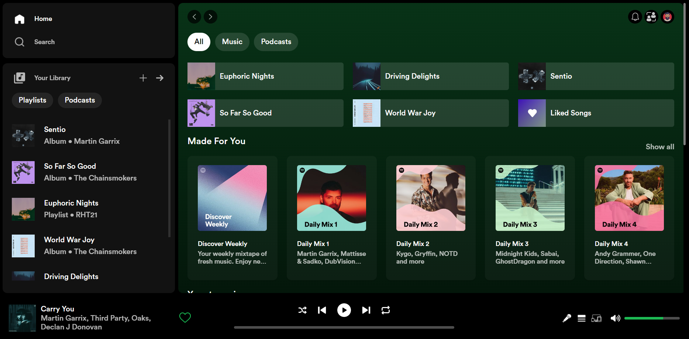

# Spotify Clone Website

A Spotify clone website with a replica of Spotify's original UI, built using HTML, CSS, and JavaScript. This project enables features such as Play/Pause, Next Song, Previous Song, volume control, and changing the progress of a song.




## Features

- Replica of Spotify's UI
- Play/Pause functionality
- Next Song/Previous Song navigation
- Volume control
- Changing the progress of a song

## Installation

1. Clone the repository:

```bash
git clone https://github.com/rht-21/spotify-clone.git
```

2. Navigate to the project directory:

```bash
cd spotify-clone
```

Open index.html in your preferred web browser.

3. Usage:

- Open the website in your web browser.
- Use the on-screen controls to play/pause songs, navigate between tracks, adjust volume, and change the progress of a song.
